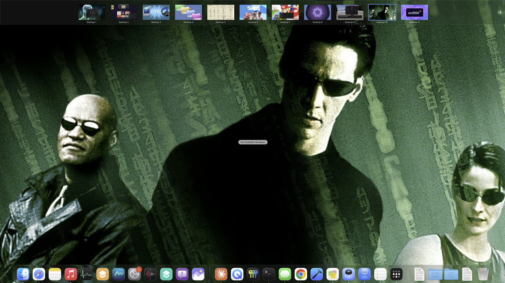

# Wallpaper Search

A tiny macOS app that turns a keyword into a fresh, high resolution desktop wallpaper. Double click it, type a theme, press Enter, and your wallpaper changes.



Every space gets its own image, so Mission Control turns into a wall of recognizable rooms instead of identical desktops.

## Why

I run a lot of Mission Control spaces and I kept getting lost in them. Every space looked the same, so glancing at Mission Control was no help at all. This fixes that by giving each space its own themed wallpaper, fast.

The workflow is simple. Switch to the space you want, launch Wallpaper Search, and type a theme for that space (say "the matrix" for one, "kyoto autumn" for another, "synthwave" for a third). macOS remembers the wallpaper per space, so now when you open Mission Control every space is instantly recognizable by its image. No more squinting at identical desktops trying to remember which one had your email and which one had your code.

## Redo it fast

Speed is the whole point. The box opens empty with a greyed "example wallpaper" hint sitting in the field, so it is obvious where to type, and re-theming is almost no work.

- Do not like the image it picked? Launch it again, type the same keyword, press Enter. Different image, every time. It remembers what it already used so you never get the same one twice until you run out.
- Want a brand new theme for a space? Launch it, type the word, press Enter. One word and one key.
- A checkbox, on by default, appends the word "wallpaper" to the search so general results come back desktop shaped. Uncheck it when you want the keyword searched literally.

So fixing a space you do not like, or theming a new one, takes about a second. Switch to the space, launch, Enter, done.

## What it does

1. You type a keyword.
2. It searches Wallhaven, a real wallpaper site, filtered to at least 1920 by 1080 and safe for work. Results are relevant and high resolution, often 4K or higher.
3. It downloads one image, normalizes it to a clean JPEG, and sets it as the desktop picture for the current space on every display.
4. It remembers what it used per keyword, so re-running gives you a different image. There are roughly 70 candidates per theme before it recycles.
5. It keeps exactly one image on disk plus a small state file, so the cache never grows.

If Wallhaven has nothing for an unusual keyword, it falls back to Bing image search with a large size filter and strict SafeSearch. To keep bad picks out, both sources are filtered to safe content, and every candidate must be landscape and wallpaper shaped (roughly 5:4 up to ultrawide) before it can be chosen, so portraits, squares, and panorama banners are skipped.

## Install

You need macOS 12 or later and the Xcode command line tools (for the Swift compiler). The engine runs on the system Python at /usr/bin/python3, no extra packages required.

```
git clone https://github.com/thejobot/wallpaper-search.git
cd wallpaper-search
./build.sh --install
```

That compiles the app, generates the icon, and copies Wallpaper Search.app into /Applications. Launch it from Spotlight or Launchpad.

To build without installing, run `./build.sh` and find the app under `build/`.

## Usage

- Launch the app. A small search box opens on whichever screen your mouse is on, empty with a greyed "example wallpaper" hint so you know where to type.
- Type a theme and press Enter. The box closes and the wallpaper updates a moment later, with a notification when it is done.
- Leave the "Add the word wallpaper to the search" box checked for desktop shaped results, or uncheck it to search your keyword literally.
- Press Escape to cancel.
- Run it again to cycle to a different image of the same theme.
- Type "reset all" instead of a theme to set every display to a plain light blue. This themes the displays in the current space, the same way a search does, so run it once per space if you use more than one.

The first time it sets a wallpaper, macOS may ask to let it control Finder and System Events, and to allow notifications. Approve those once and it is smooth after that.

## How the wallpaper is set

It uses the same mechanism as the Finder right click "Set Desktop Picture" command, plus a System Events pass to cover multiple displays. Setting the wallpaper while you are inside a given Mission Control space applies it to that space only, which is what makes the per space theming work.

## Files

- `src/main.swift` The search box, a small AppKit app that launches the engine.
- `src/wallpaper.py` The engine: search, download, validate, set, remember.
- `src/iconmaker.swift` Renders the app icon.
- `build.sh` Compiles and assembles everything into the app bundle.

## Notes

- State lives in `~/Library/Caches/WallpaperSearch/`. Delete that folder to reset history.
- The app is ad hoc signed. It is built locally so it launches without a Gatekeeper prompt.

## License

MIT. See LICENSE.
